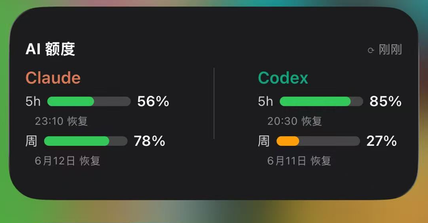

# 双子续杯 🍵

> 一眼看清 Claude Code + Codex 还能写多久 —— iPhone 桌面小组件，纯本地、零成本。
>
> 「双子」= Claude + Codex 两个 Agent，「续杯」= 额度喝完得等下一轮。组件标题：**别问了还剩这么点🤏**

重度用 Claude Code / OpenAI Codex 的人都有「额度焦虑」：当前这个 5 小时窗口还能不能继续猛写代码？跑长任务不能打断去查、人不在电脑前也想知道。

这个小组件把两个平台的额度做成 iPhone 负一屏卡片，**左滑即见，无需点开、无需刷新**。

## 特性
- **双平台统一视图**：Claude Code + Codex 的 5小时 / 本周 剩余额度 + 恢复时间
- **只用一个也行**：只配 Claude 或只配 Codex 时自动单列显示
- **纯手机本地**：用 [Scriptable](https://scriptable.app/)（免费）写的原生组件，零服务器、零费用、无需 Apple 开发者账号
- **Mac 关机也能看**：手机侧直接调各平台 OAuth 接口，token 存 iPhone Keychain
- **零打断**：进度条像电量，剩余越少越红，一眼判断

## 环境要求
- **iPhone**（iOS 14+）—— Scriptable 是 iOS 独占，**安卓无法使用**
- **macOS** —— 导出 token 的脚本目前只支持 macOS（Win/Linux 欢迎 PR）
- 已登录 **Claude Code**（桌面版/CLI）和/或 **Codex CLI**（token 才存在本地）

## 安装
见 [SETUP.md](SETUP.md)。三步：Mac 导出 token → 拷到手机 → Scriptable 运行一次导入，然后桌面加中号组件。

## 数据来源
- Claude：`GET https://api.anthropic.com/api/oauth/usage`（token 在 macOS Keychain `Claude Code-credentials`）
- Codex：`GET https://chatgpt.com/backend-api/wham/usage`（token 在 `~/.codex/auth.json`）

两接口只返回百分比 + 重置时间（不含 token 计数），均为**社区逆向的非官方接口**，仅用本机已登录的 token 调用。详见 [PROJECT.md](PROJECT.md)。

## 安全说明
- token 只存在**你自己 iPhone 的 Keychain**，脚本不上传任何第三方服务器
- 仅用于查询**你自己账号**的额度
- 接口非官方，平台调整可能导致失效；token 刷新所用 client_id 为社区已知值

## 技术栈
Scriptable (JavaScript) · WidgetKit 中号组件 · iOS Keychain · OAuth token 自动续期

## License
MIT
